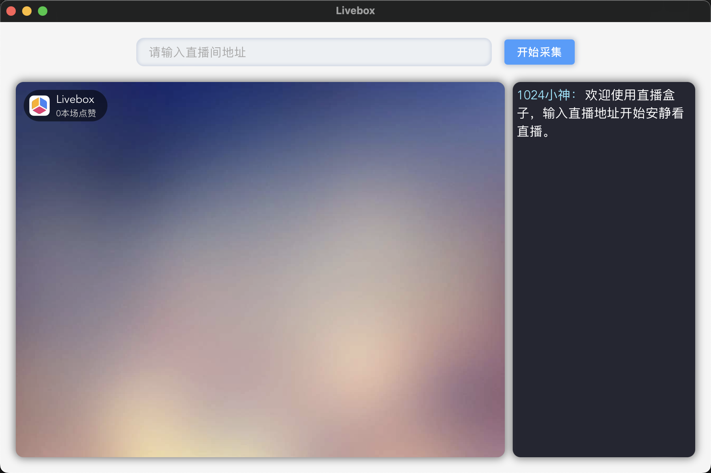
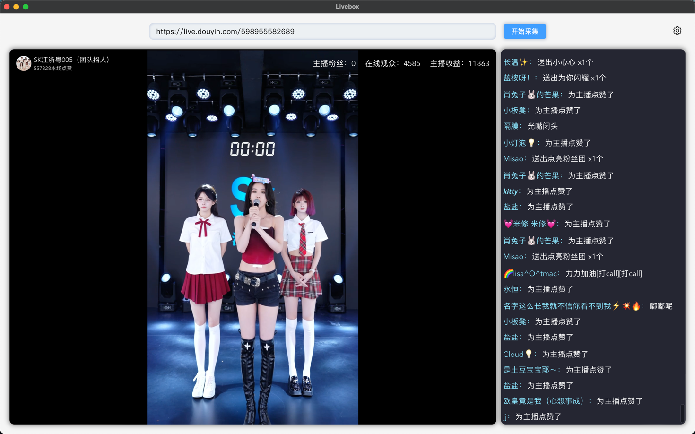
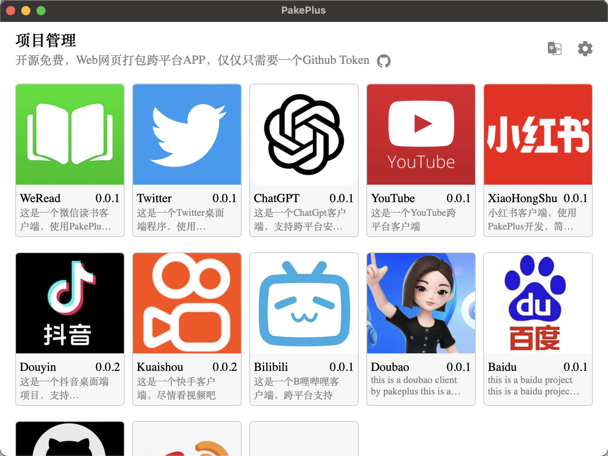

# 直播原理学习研究

欢迎参观我的CSDN博客：[我的CSDN博客，阅读量过260W，粉丝过3W](https://blog.csdn.net/weixin_44786530?spm=1000.2115.3001.5343)  
欢迎参观我的掘金博客：[我的掘金博客，阅读量过100，粉丝2个](https://juejin.cn/user/70007368988926)

# 环境大于3.6应该都可以

```
python 3.9 
```
附上windows的python3.9.2安装包：https://wwd.lanzouq.com/i6AEm02zzppi


# 抖音直播桌面版  
LiveBox是一个抖音直播桌面版本，输入抖音直播地址，就可以安安静静看直播和弹幕消息，拒绝消费，冷静看播。
特点：  
1.超级轻量，只有5M，不占内存，不占CPU，不占GPU，不占硬盘。
2.未来会增加多窗口支持，和登录支持，还可以自动化抢购和抢福袋等功能。  
仓库地址：https://github.com/Sjj1024/LiveBox  
桌面安装包下载地址：  
https://github.com/Sjj1024/LiveBox/releases

LiveBox桌面版展示：




# PakePlus项目介绍
PakePlus项目：Turn any webpage into a desktop app and mobile app with Rust.
利用 Rust 轻松构建轻量级多端桌面应用和多端手机应用，使用介绍：https://sjj1024.github.io/PakePlus/
只需要9分钟就可以将任何网站打包成多端应用，仓库地址：https://github.com/Sjj1024/PakePlus  
PakePlus展示：



# 注意注意
注意：这只是Python学习研究直播技术的仓库，不是黑客。请勿用于非法用途。一切违法行为后果自负！